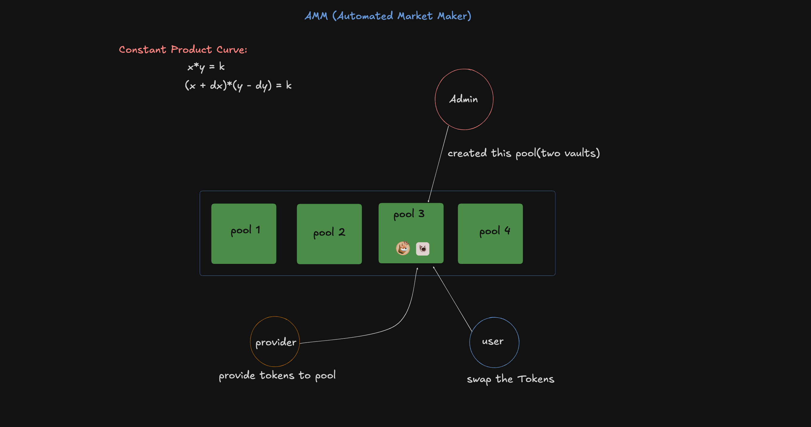
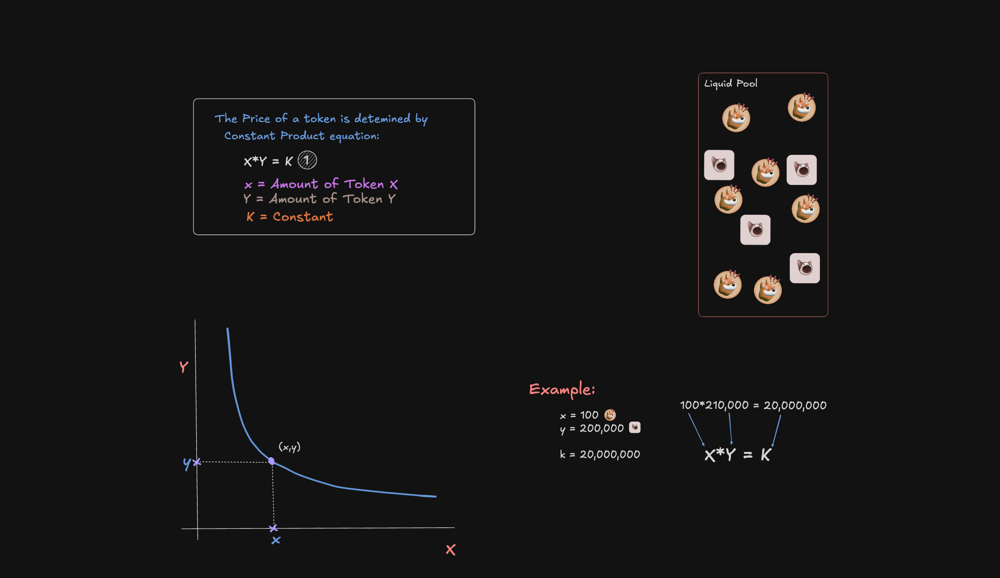
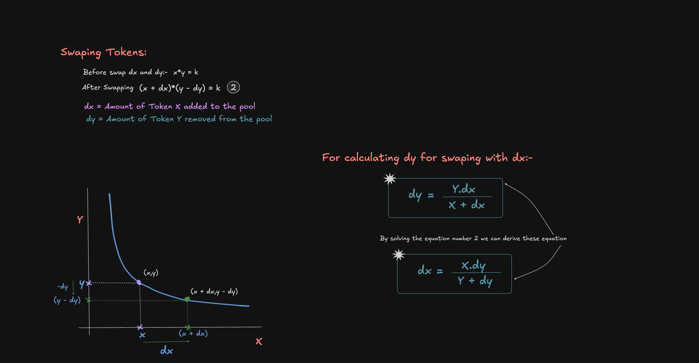
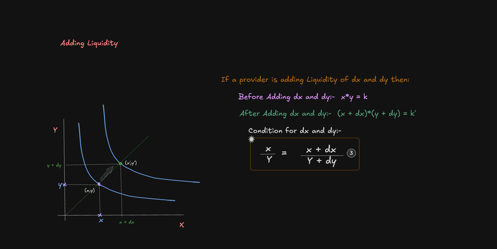
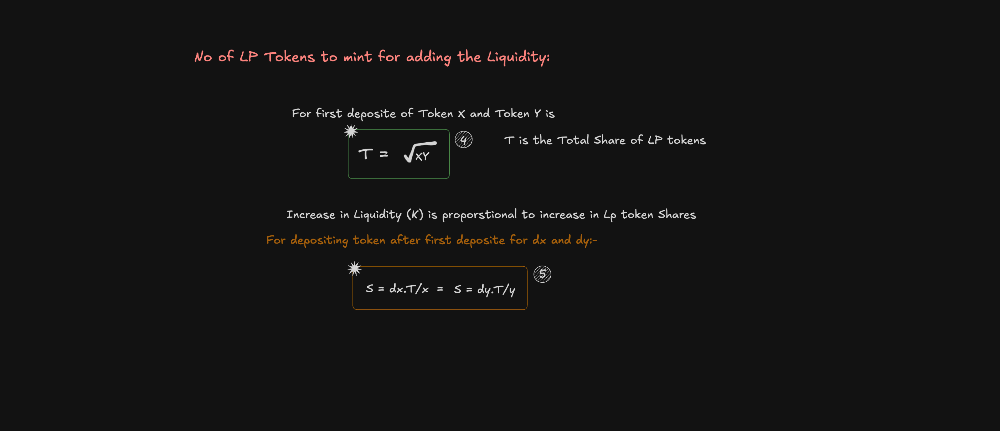
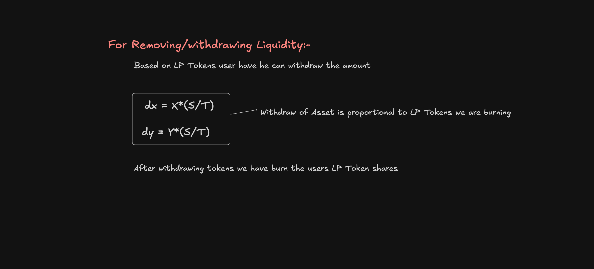

# Automated Market Maker (AMM)

## Overview

The Automated Market Maker (AMM) is a fully backed, decentralized exchange protocol built using the Anchor framework on the Solana blockchain. Unlike traditional order book trading systems, this AMM leverages algorithmic models to dynamically set prices based on asset supply and demand within liquidity pools.

## Key Features

- **Constant Product AMM:** Enables efficient two-token trading by leveraging a constant product formula.
- **Multiple Liquidity Pools:** Administrators can create and manage various pools, enhancing trading flexibility.
- **Token Swapping:** Provides seamless token exchange capabilities.
- **Liquidity Provision:** Allows users to effortlessly add liquidity to pools to support the network’s trading operations.
- **LP Token Minting:** Automatically issues Liquidity Pool tokens to users upon the addition of liquidity.
- **Liquidity Withdrawal:** Facilitates secure and straightforward asset removal from pools.

## Operational Model

Our AMM employs the constant product formula, a proven approach that maintains market equilibrium and allows for reliable, predictable trading rates despite liquidity fluctuations.

## Program Architecture

  
  
Overview of the system where administrators create multiple pools and users engage in token swaps or liquidity deposits.

## Detailed Visuals

- **Constant Product Curve:**
  

    
  

- **Token Swapping:**
  

    
  

- **Adding Liquidity:**
  

    
  

- **LP Token Minting:**
  

    
  

- **Liquidity Withdrawal:**
  

    
  

## Development Status

- **Smart Contract Development:** Completed
- **Testing:** Completed
- **Frontend Integration:** In Progress

## Contributing

We welcome contributions to improve this project. To contribute:

1. Fork the repository.
2. Create a new branch (e.g., `feature/your-feature-name`).
3. Make your changes and commit them with a clear, descriptive message.
4. Push your branch to your fork.
5. Open a Pull Request to propose your changes.

## References

- [AMM Blog Post](https://www.infect3d.xyz/blog/Exploring-AMMs) — A comprehensive guide by [@InfectedCrypto](https://x.com/InfectedCrypto) that explains AMM principles effortlessly.
- [Constant Product Equation](https://youtu.be/QNPyFs8Wybk?si=TlaNLr0reoL3_S5S) — A detailed video by [@ProgrammerSmart](https://x.com/ProgrammerSmart) covering the mathematical foundations behind the AMM.
